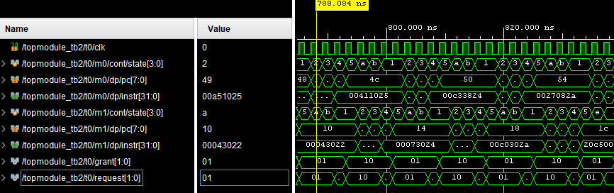
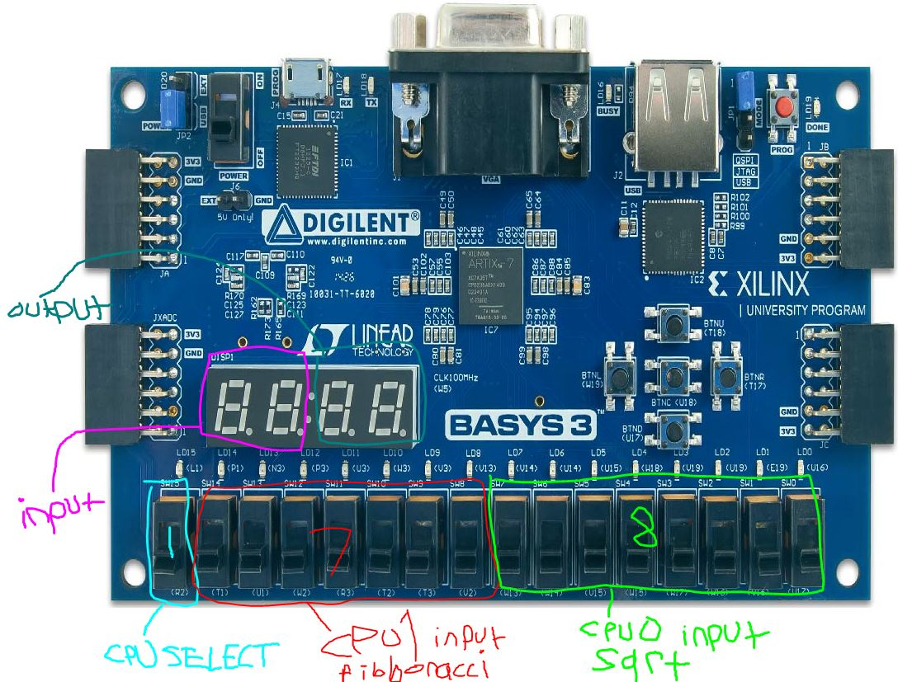

# Dual Core CPU

This MIPS inspired Dual Core CPU was designed and verified as a part of a Verilog/System Verilog development course. It features a simple 32 bit instruction word, non-pipelined, dual-core cpu with system bus arbitration and an instruction cache. It was later synthesized to Xilinx FPGA. Uses memory-mapped I/O to display basic (sevseg) output and take input from switches. Can run several tested programs (loaded from pre-configured hex memory files) concurrently (isquare root, fibonacci, etc).

## Screenshots

  
  
  
  
  

