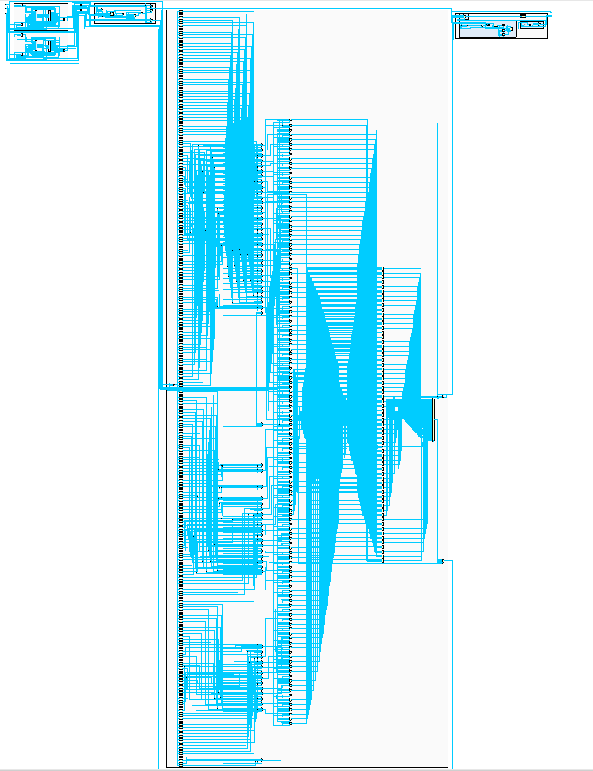
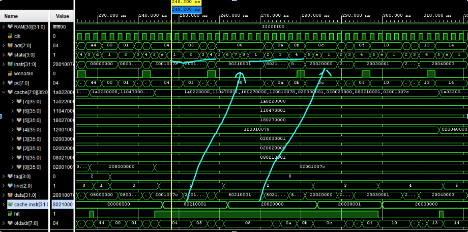

# Project Title

A brief description of what this project does and who it's for

# Dual Core CPU

This Dual Core CPU was designed and verified as a part of a Verilog/System Verilog development course. It features a simple 16 bit, non-pipelined, dual-core cpu with system bus arbitration and an instruction cache. 

## Screenshots

  
  
  
  

